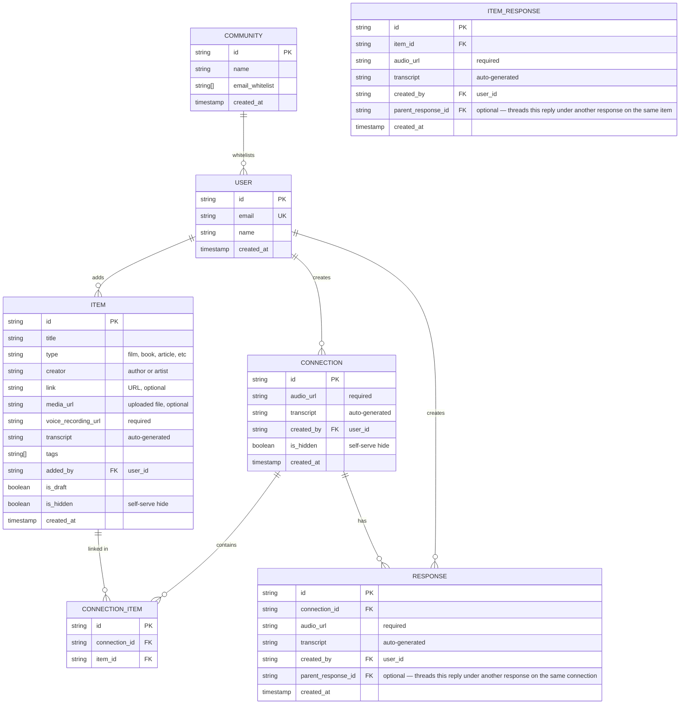

# Kanon Data Model

## Entity-Relationship Diagram



## Design Decisions

### Audio Requirements
| Entity | Audio | Rationale |
|--------|-------|-----------|
| Item | Required | Core friction—voice recording is the soul of the archive |
| Connection | Required | Drawing a relationship deserves explanation |
| Response | Required | The reason to respond is to add your voice |

### Threaded Responses
Both item responses and connection responses carry an optional `parent_response_id`. When set, the new audio response is a direct reply to that specific response rather than to the underlying item/connection. This enables back-and-forth audio dialogue within an archive entry without introducing a separate collection: responses form a tree rooted at the item or connection, where `parent_response_id == null` (or missing) denotes a top-level response and any other value is a reply.

### Multi-Item Connections
Connections can link 2+ items through the `CONNECTION_ITEM` junction table. This allows users to say "these five things all relate" in a single gesture rather than creating multiple binary connections.

### No Deletion, Only Hiding
Items and connections have `is_hidden` flags rather than deletion. Hidden content remains in the database and visible to the creator, but disappears from the community view. This preserves the principle that past opinions remain truthful and valuable.

### Drafts
Items support `is_draft` for the "save and return later" flow when users abandon the add flow mid-way.

### No Profile Photos

Users have only `name`—no photos, no bios. Contributions matter, not individual identity.

## Firebase Collections

```
/communities/{communityId}
/users/{userId}
/items/{itemId}
/connections/{connectionId}
/connections/{connectionId}/items/{connectionItemId}
/connections/{connectionId}/responses/{responseId}
```

## Open Questions

- Should connections also support drafts?
- Should hiding require a private note explaining why?
- How to handle transcription failures from Whisper API? 