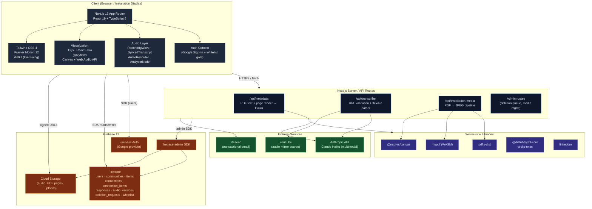
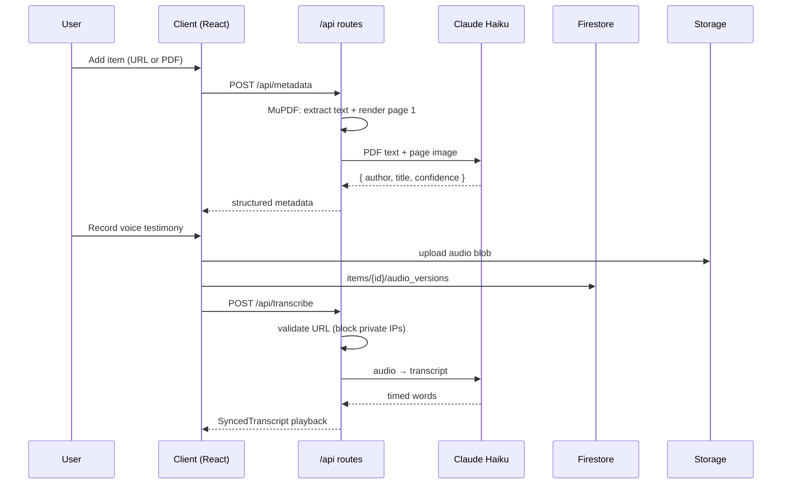
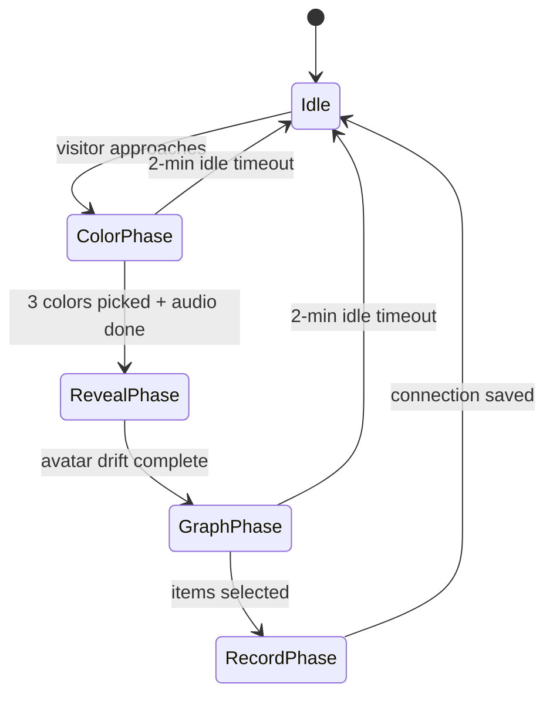

# Kanon — Architecture Diagram

```mermaid
flowchart TB
    subgraph Client["Client (Browser / Installation Display)"]
        direction TB
        UI["Next.js 16 App Router<br/>React 19 + TypeScript 5"]
        Style["Tailwind CSS 4<br/>Framer Motion 12<br/>dialkit (live tuning)"]
        Viz["Visualization<br/>D3.js · React Flow (@xyflow)<br/>Canvas + Web Audio API"]
        Audio["Audio Layer<br/>RecordingWave · SyncedTranscript<br/>AudioRecorder · AnalyserNode"]
        Auth["Auth Context<br/>(Google Sign-In + whitelist gate)"]
        UI --> Style
        UI --> Viz
        UI --> Audio
        UI --> Auth
    end

    subgraph Edge["Next.js Server / API Routes"]
        direction TB
        Meta["/api/metadata<br/>PDF text + page render → Haiku"]
        Trans["/api/transcribe<br/>URL validation + flexible parser"]
        Media["/api/installation-media<br/>PDF → JPEG pipeline"]
        AdminAPI["Admin routes<br/>(deletion queue, media mgmt)"]
    end

    subgraph Libs["Server-side Libraries"]
        MuPDF["mupdf (WASM)"]
        PDFjs["pdfjs-dist"]
        NCanvas["@napi-rs/canvas"]
        Ytdl["@distube/ytdl-core<br/>yt-dlp-exec"]
        Linkedom["linkedom"]
    end

    subgraph Firebase["Firebase 12"]
        direction TB
        FAuth["Firebase Auth<br/>(Google provider)"]
        FStore["Firestore<br/>users · communities · items<br/>connections · connection_items<br/>responses · audio_versions<br/>deletion_requests · whitelist"]
        FStorage["Cloud Storage<br/>(audio, PDF pages, uploads)"]
        FAdmin["firebase-admin SDK"]
    end

    subgraph External["External Services"]
        Anthropic["Anthropic API<br/>Claude Haiku (multimodal)"]
        Resend["Resend<br/>(transactional email)"]
        YouTube["YouTube<br/>(audio mirror source)"]
    end

    Client -->|"HTTPS / fetch"| Edge
    Client -->|"SDK (client)"| FAuth
    Client -->|"SDK reads/writes"| FStore
    Client -->|"signed URLs"| FStorage

    Edge --> Libs
    Edge -->|"admin SDK"| FAdmin
    FAdmin --> FStore
    FAdmin --> FStorage

    Meta --> Anthropic
    Trans --> Anthropic
    Trans --> YouTube
    Media --> PDFjs
    Media --> MuPDF
    Media --> NCanvas
    Edge --> Resend

    classDef client fill:#1e293b,stroke:#64748b,color:#f1f5f9
    classDef edge fill:#0f172a,stroke:#3b82f6,color:#dbeafe
    classDef fb fill:#7c2d12,stroke:#fb923c,color:#fed7aa
    classDef ext fill:#14532d,stroke:#4ade80,color:#dcfce7
    classDef lib fill:#312e81,stroke:#818cf8,color:#e0e7ff

    class UI,Style,Viz,Audio,Auth client
    class Meta,Trans,Media,AdminAPI edge
    class FAuth,FStore,FStorage,FAdmin fb
    class Anthropic,Resend,YouTube ext
    class MuPDF,PDFjs,NCanvas,Ytdl,Linkedom lib
```

## Data Flow Highlights

```mermaid
sequenceDiagram
    participant U as User
    participant C as Client (React)
    participant API as /api routes
    participant H as Claude Haiku
    participant FS as Firestore
    participant ST as Storage

    U->>C: Add item (URL or PDF)
    C->>API: POST /api/metadata
    API->>API: MuPDF: extract text + render page 1
    API->>H: PDF text + page image
    H-->>API: { author, title, confidence }
    API-->>C: structured metadata

    U->>C: Record voice testimony
    C->>ST: upload audio blob
    C->>FS: items/{id}/audio_versions
    C->>API: POST /api/transcribe
    API->>API: validate URL (block private IPs)
    API->>H: audio → transcript
    H-->>API: timed words
    API-->>C: SyncedTranscript playback
```

## Installation Display Loop

```mermaid
stateDiagram-v2
    [*] --> Idle
    Idle --> ColorPhase: visitor approaches
    ColorPhase --> RevealPhase: 3 colors picked + audio done
    RevealPhase --> GraphPhase: avatar drift complete
    GraphPhase --> RecordPhase: items selected
    RecordPhase --> Idle: connection saved
    GraphPhase --> Idle: 2-min idle timeout
    ColorPhase --> Idle: 2-min idle timeout
```
